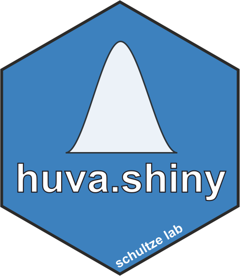

# Shiny App for interactive *huva* analysis
 
 

This shiny app provides an interactive interface for the *huva* analysis (v. 0.1.5). The user can run quickly all type of *huva experiments* interactively (*GOI experiment, SOI experiment and POI experiment*) with no requirement of coding skills.

 

For a detailed description of the *huva* framework please refer to the [R package documentation](https://github.com/lorenzobonaguro/huva) and the publication [Human variation in population-wide gene expression data predicts gene perturbation phenotype; Bonaguro et al. 2022](https://www.cell.com/iscience/fulltext/S2589-0042(22)01600-5#%20)

 

## How to use the *huva* shiny app
Run the app on locally on R (tested on R version 4.0.0, Bioconductor 3.11 and R 3.6.2, Bioconductor 3.9) after installation of all required packages, for more comfortable usage a [docker image](https://hub.docker.com/r/lorenzobonaguro/huva.shiny_docker) is also provided. For direct access the shiny app is also hosted on [FASTGenomics](https://beta.fastgenomics.org/a/huva)